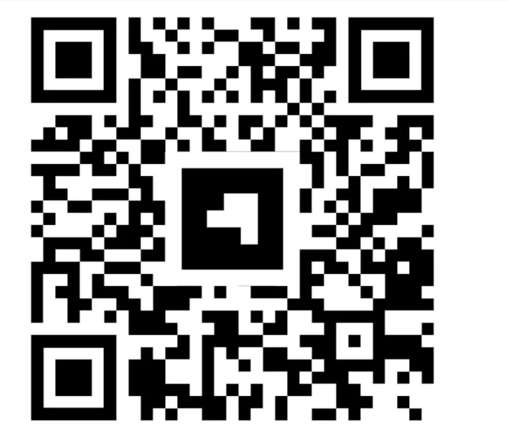

# Augmented Reality 3D Logo with QR Code

This project demonstrates how to create an augmented reality experience using AR.js and a 3D model. The experience is accessed by scanning a QR code that directs users to the AR application.

## Idea Overview

The concept behind this project is inspired by [Jelena Ristic's article](https://jelena-ristic.medium.com/how-to-create-an-augmented-reality-3d-logo-with-blender-and-ar-js-1d7097456eb0). In her tutorial, Jelena outlines the process of creating a 3D logo using Blender and integrating it into a web-based AR application using AR.js. 

This project showcases how users can interact with a 3D model in augmented reality simply by scanning a QR code. The QR code links to an AR application that can be accessed from a mobile device or any compatible screen.

## How to Use

To experience the augmented reality 3D logo, follow these steps:

1. **Open the QR Code**: Use another laptop, mobile device, or screen to display the QR code. You can do this by opening the image of the QR code provided above.

2. **Access the AR Application**:
   - Open your phone's web browser.
   - Navigate to the following URL: [https://ar-theta-ten.vercel.app/](https://ar-theta-ten.vercel.app/).

3. **Scan the QR Code**:
   - Point your mobile device's camera at the displayed QR code on the other screen.
   - The AR application will launch, and you should see the 3D logo rendered in augmented reality.

## Credits

This project is based on the tutorial by **Jelena Ristic**. You can find her detailed explanation and walkthrough in her article: [How to Create an Augmented Reality 3D Logo with Blender and AR.js](https://jelena-ristic.medium.com/how-to-create-an-augmented-reality-3d-logo-with-blender-and-ar-js-1d7097456eb0).

## Conclusion

This project exemplifies the intersection of 3D modeling and augmented reality technology, allowing users to engage with digital content in innovative ways. Feel free to explore and modify the project for your own AR experiences!
